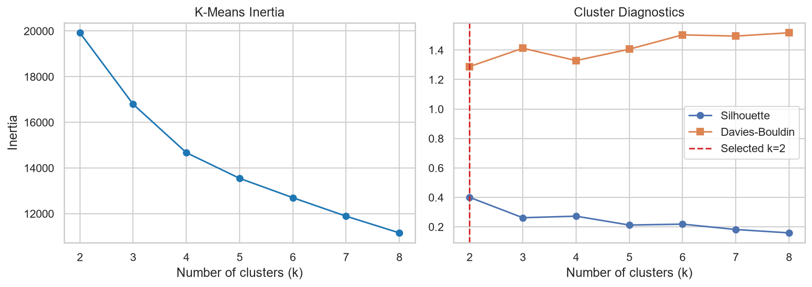
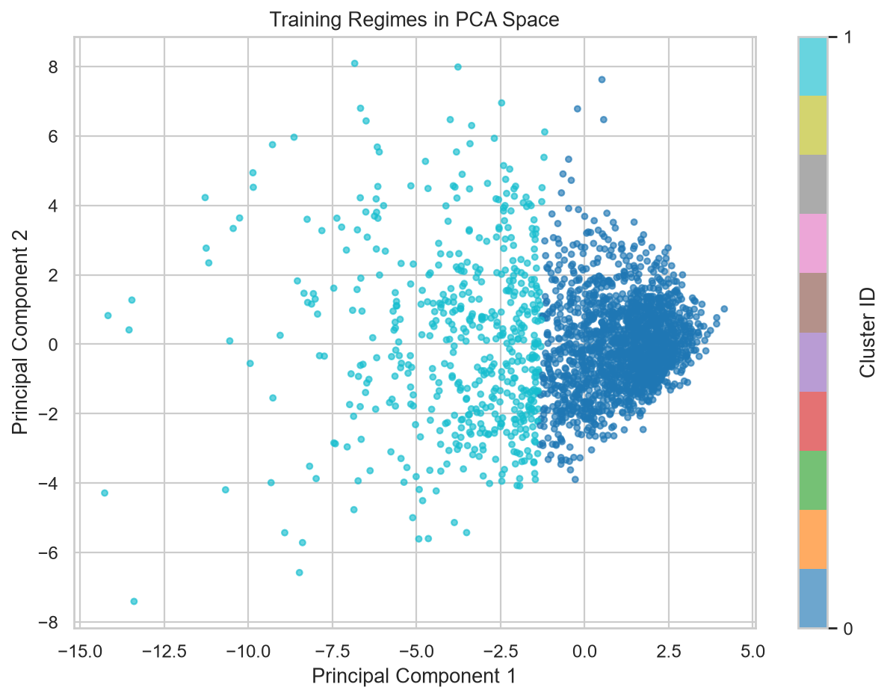
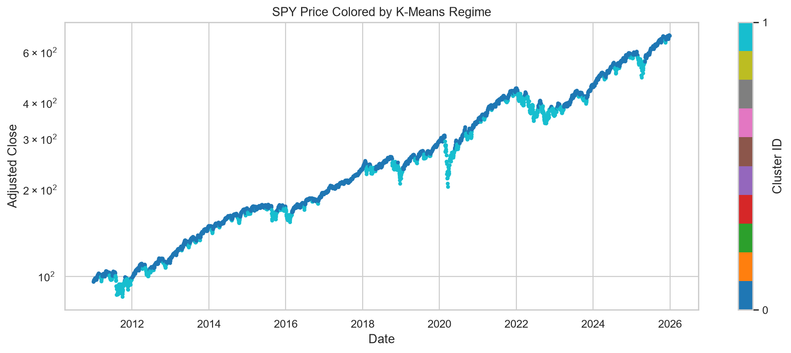
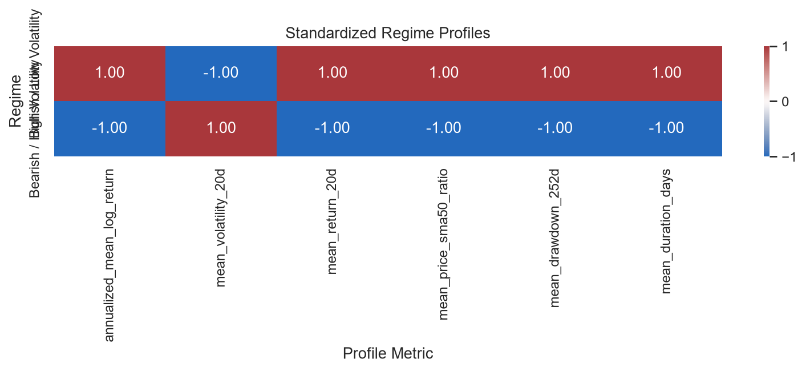
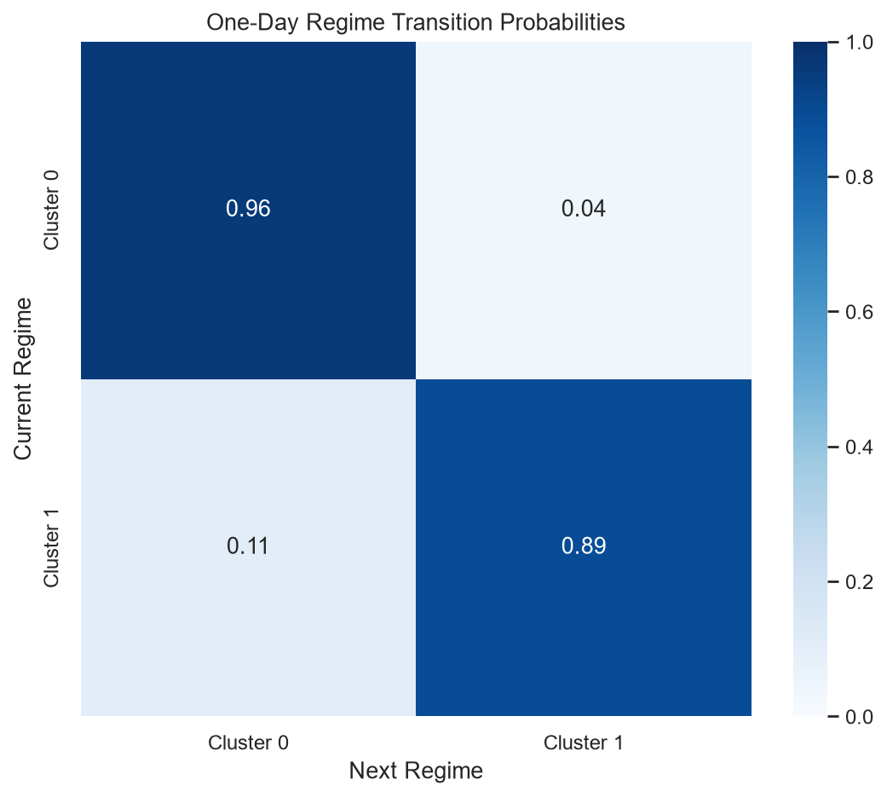
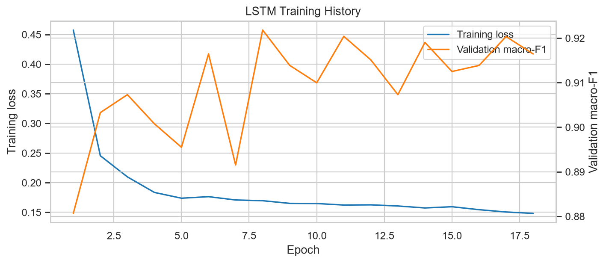
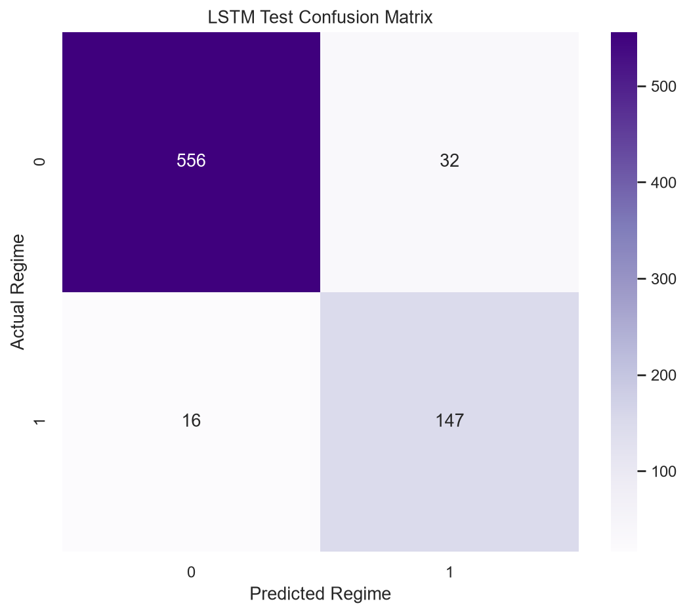

# SPY Market Regime Clustering and LSTM Forecasting for Options Strategy Research

**Published:** June 30, 2026  
**Project:** [Code, notebook, and reproducibility instructions](../quant-research/spy-market-regime-clustering-lstm/)  
**Data:** SPY daily OHLCV, 2010-01-04 through 2025-12-31

## Executive Summary

This research applies K-Means Clustering to backward-looking SPY market features, then trains a PyTorch LSTM to predict the next trading day's model-generated regime. The project demonstrates unsupervised learning, deep-learning sequence modeling, chronological validation, and baseline comparison within the existing quantitative trading research portfolio.

The selected K-Means solution used **2 clusters**, with a training silhouette score of **0.400** and Davies-Bouldin score of **1.288**. The deep-learning results are reported against persistence and logistic-regression baselines without requiring the LSTM to outperform them.

## Options-Research Relevance

Market regimes can provide context for options research because trend, realized volatility, drawdown, and transition behavior influence the environment in which covered-call rules are evaluated. This project does not model option premiums or covered-call profitability. It provides a systematic state-classification layer that could support future options-strategy research.

## Data and Chronological Validation

- **Train:** 2010-01-01 through 2019-12-31
- **Validation:** 2020-01-01 through 2022-12-31
- **Test:** 2023-01-01 through 2025-12-31
- **Source:** Yahoo Finance via yfinance (local cache)
- **Raw observations:** 4,024

Feature scaling and K-Means fitting use training data only. Validation and test observations are transformed with the frozen training scaler and assigned to the frozen training centroids.

## Features

The clustering input contains daily, 5-day, and 20-day returns; 10/20/60-day realized volatility; price/SMA and SMA/SMA ratios; RSI-14; normalized ATR-14; a 20-day volume z-score; and 252-day drawdown. Every feature is backward-looking at the observation date.

## K-Means Clustering

Candidate values from `k=2` through `k=8` were evaluated with inertia, silhouette score, Davies-Bouldin score, and minimum cluster share. The deterministic rule selected the highest-silhouette solution whose smallest training cluster represented at least 5% of observations; candidates within 0.01 of the best silhouette favored the smaller `k`.

## Regime Profiles

| Cluster | Descriptive Label | Share | Annualized Mean Log Return | Mean 20-Day Volatility | Mean Duration |
|---:|---|---:|---:|---:|---:|
| 0 | Bullish / Low Volatility | 72.3% | 36.6% | 11.1% | 24.3 days |
| 1 | Bearish / High Volatility | 27.7% | -48.0% | 23.6% | 9.4 days |

Descriptive labels are derived from training-period return and volatility profiles. Numeric cluster IDs remain the authoritative model output.

## Deep Learning Model

The PyTorch model uses a 20-trading-day feature sequence, two LSTM layers, hidden size 64, dropout 0.20, and a linear classification head. Training uses weighted cross-entropy, AdamW, early stopping on validation macro-F1, and deterministic seed 42.

## Test Results

| Model | Accuracy | Balanced Accuracy | Macro-F1 |
|---|---:|---:|---:|
| Regime persistence | 0.940 | 0.913 | 0.912 |
| Logistic regression | 0.940 | 0.917 | 0.913 |
| PyTorch LSTM | 0.936 | 0.924 | 0.909 |

The persistence baseline predicts that tomorrow's regime will match today's. Logistic regression uses the flattened 20-day feature sequence. The LSTM is evaluated on the same fixed 2023-2025 test period.

## Limitations

- K-Means imposes spherical clusters and requires a chosen feature space and cluster count.
- Regime labels are model-generated descriptions, not objective market states.
- The LSTM predicts K-Means labels rather than returns, option prices, or trading profits.
- SPY history is one instrument and one sample period; other assets may produce different regimes.
- Market data, adjusted prices, and feature definitions can change results.
- Strong persistence can make a simple baseline difficult to beat and must be reported honestly.

## Reproducibility

The project includes modular Python source, an executable notebook, fixed date splits, deterministic random seeds, tests, generated metrics, cluster profiles, and regime assignments. Raw Yahoo Finance data is cached locally and excluded from Git.

## Disclaimer

This report is for research and educational purposes only and is not financial advice. The analysis does not recommend an options position or claim that identified regimes will persist in live markets.
